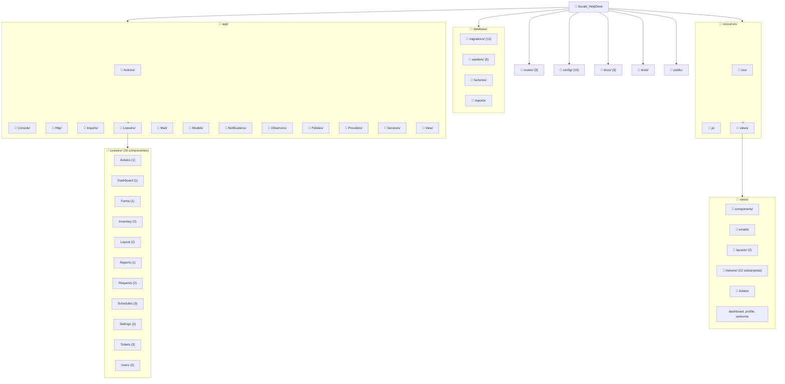
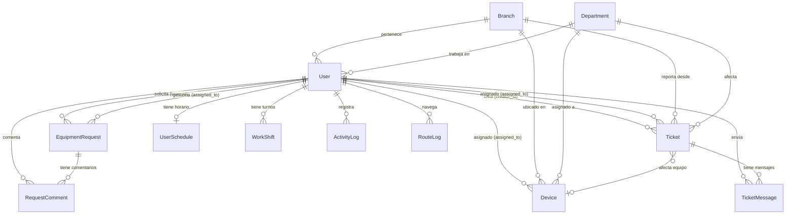

# 🔍 Auditoría Profunda — Suraki HelpDesk
> **Fecha:** 30 de Junio 2026 | **Versión del Stack:** Laravel 13.8 / Livewire 3.6 / PHP 8.3+ / MySQL  
> **Auditor:** Antigravity AI Agent

---

## 📂 1. Mapa de Estructura del Proyecto



### Árbol de Archivos Detallado

```
📁 Suraki_HelpDesk/
├── 📁 app/
│   ├── 📁 Actions/Tickets/
│   │   └── CreateTicketAction.php          ← Lógica de auto-asignación + prioridad IA
│   ├── 📁 Console/                         ← Vacío (sin Artisan commands)
│   ├── 📁 Http/
│   │   ├── 📁 Controllers/Auth/            ← VerifyEmailController
│   │   │   └── Controller.php
│   │   └── 📁 Middleware/
│   │       ├── CheckRole.php               ← Control de acceso por rol
│   │       ├── CheckUserStatus.php         ← Bloqueo/Inactivación de cuentas
│   │       └── LogRouteRequests.php        ← Logging de rutas HTTP
│   ├── 📁 Imports/
│   │   └── EquiposImport.php               ← Importación masiva Excel
│   ├── 📁 Livewire/ (16 componentes)
│   │   ├── Actions/Logout.php
│   │   ├── Dashboard/DashboardCharts.php
│   │   ├── Forms/LoginForm.php
│   │   ├── Inventory/InventoryForm.php
│   │   ├── Inventory/InventoryList.php
│   │   ├── Layout/NotificationBell.php
│   │   ├── Reports/Index.php
│   │   ├── Requests/RequestForm.php
│   │   ├── Requests/RequestList.php
│   │   ├── Schedules/ScheduleForm.php
│   │   ├── Schedules/ScheduleList.php
│   │   ├── Schedules/WorkShiftsList.php
│   │   ├── Settings/SettingsList.php
│   │   ├── Tickets/TicketDetail.php
│   │   ├── Tickets/TicketForm.php
│   │   ├── Tickets/TicketList.php
│   │   ├── Users/UserForm.php
│   │   └── Users/UserList.php
│   ├── 📁 Mail/
│   │   └── UserCredentialsMail.php
│   ├── 📁 Models/ (12 modelos)
│   │   ├── ActivityLog.php
│   │   ├── Branch.php
│   │   ├── Department.php
│   │   ├── Device.php
│   │   ├── EquipmentRequest.php
│   │   ├── RequestComment.php
│   │   ├── RouteLog.php
│   │   ├── Ticket.php
│   │   ├── TicketMessage.php
│   │   ├── User.php
│   │   ├── UserSchedule.php
│   │   └── WorkShift.php
│   ├── 📁 Notifications/ (5)
│   │   ├── PasswordResetAdminNotification.php
│   │   ├── ProfileUpdatedNotification.php
│   │   ├── TicketCreated.php
│   │   ├── TicketCriticoNotification.php
│   │   └── TicketStatusUpdatedNotification.php
│   ├── 📁 Observers/
│   │   └── TicketObserver.php
│   ├── 📁 Policies/
│   │   ├── EquipmentRequestPolicy.php
│   │   └── TicketPolicy.php
│   ├── 📁 Providers/
│   │   ├── AppServiceProvider.php
│   │   └── VoltServiceProvider.php
│   └── 📁 Services/
│       ├── ActivityLogger.php
 guide   ├── ScheduleService.php
│       └── TicketStatsService.php
├── 📁 database/
│   ├── 📁 migrations/ (12 archivos)
│   ├── 📁 seeders/ (5 archivos)
│   ├── 📁 factories/
│   └── 📁 imports/
├── 📁 resources/views/
│   ├── 📁 layouts/ (app.blade.php, guest.blade.php)
│   ├── 📁 livewire/ (12 subcarpetas con vistas Blade)
│   ├── dashboard.blade.php
│   ├── profile.blade.php
│   └── welcome.blade.php
├── 📁 routes/
│   ├── web.php        ← 18 rutas definidas
│   ├── auth.php       ← 6 rutas de autenticación
│   └── console.php
├── 📁 config/ (10 archivos de configuración)
├── 📁 docs/ (3 documentos)
├── 📁 tests/ (4 Feature + 1 Unit)
└── 📁 public/
```

---

## 📊 2. Informe por Módulo

### 2.1 🎫 Módulo de Tickets (Soporte Técnico)

| Elemento | Archivo | Estado |
|----------|---------|--------|
| Modelo | [Ticket.php](file:///c:/Users/Pagina-Web1/Desktop/Suraki_HelpDesk/app/Models/Ticket.php) | ✅ Completo |
| Modelo Messages | [TicketMessage.php](file:///c:/Users/Pagina-Web1/Desktop/Suraki_HelpDesk/app/Models/TicketMessage.php) | ✅ Completo |
| Listado | [TicketList.php](file:///c:/Users/Pagina-Web1/Desktop/Suraki_HelpDesk/app/Livewire/Tickets/TicketList.php) | ✅ Con filtros/tabs |
| Formulario | [TicketForm.php](file:///c:/Users/Pagina-Web1/Desktop/Suraki_HelpDesk/app/Livewire/Tickets/TicketForm.php) | ✅ Cache dropdowns |
| Detalle | [TicketDetail.php](file:///c:/Users/Pagina-Web1/Desktop/Suraki_HelpDesk/app/Livewire/Tickets/TicketDetail.php) | ✅ Chat + Adjuntos |
| Auto-asignación | [CreateTicketAction.php](file:///c:/Users/Pagina-Web1/Desktop/Suraki_HelpDesk/app/Actions/Tickets/CreateTicketAction.php) | ✅ IA Keywords + Load Balancing |
| Observer | [TicketObserver.php](file:///c:/Users/Pagina-Web1/Desktop/Suraki_HelpDesk/app/Observers/TicketObserver.php) | ✅ Notificaciones automáticas |
| Policy | [TicketPolicy.php](file:///c:/Users/Pagina-Web1/Desktop/Suraki_HelpDesk/app/Policies/TicketPolicy.php) | ✅ Roles aplicados |
| Tests | [CreateTicketActionTest.php](file:///c:/Users/Pagina-Web1/Desktop/Suraki_HelpDesk/tests/Feature/CreateTicketActionTest.php), [TicketPolicyTest.php](file:///c:/Users/Pagina-Web1/Desktop/Suraki_HelpDesk/tests/Feature/TicketPolicyTest.php) | ✅ Cubiertos |

**Conexiones:**  
`Ticket` → `Branch`, `Department`, `Device`, `User(creator)`, `User(assigned_to)`, `TicketMessage`  
**Flujo:** Usuario crea → `CreateTicketAction` calcula prioridad + asigna admin → `TicketObserver` dispara notificaciones → Admin gestiona desde `TicketDetail`

> [!NOTE]
> El `calculatePriority()` en `CreateTicketAction` usa análisis de palabras clave. Sobrescribe la prioridad del usuario — esto podría causar confusión si el usuario selecciona "baja" pero el sistema la eleva a "crítica".

---

### 2.2 📋 Módulo de Requerimientos (Requests)

| Elemento | Archivo | Estado |
|----------|---------|--------|
| Modelo | [EquipmentRequest.php](file:///c:/Users/Pagina-Web1/Desktop/Suraki_HelpDesk/app/Models/EquipmentRequest.php) | ✅ Soft Deletes |
| Modelo Comentarios | [RequestComment.php](file:///c:/Users/Pagina-Web1/Desktop/Suraki_HelpDesk/app/Models/RequestComment.php) | ✅ Completo |
| Formulario Wizard | [RequestForm.php](file:///c:/Users/Pagina-Web1/Desktop/Suraki_HelpDesk/app/Livewire/Requests/RequestForm.php) | ✅ 3 pasos |
| Listado + Modales | [RequestList.php](file:///c:/Users/Pagina-Web1/Desktop/Suraki_HelpDesk/app/Livewire/Requests/RequestList.php) | ⚠️ BUG detectado |
| Policy | [EquipmentRequestPolicy.php](file:///c:/Users/Pagina-Web1/Desktop/Suraki_HelpDesk/app/Policies/EquipmentRequestPolicy.php) | ✅ Con lógica 15 días |

> [!WARNING]
> **BUG CRÍTICO en `RequestList.php` línea 140:** Se usa `$user->id` pero la variable `$user` no está definida. Debería ser `auth()->id()`. Esto provocará un **error fatal** al agregar comentarios.

---

### 2.3 💻 Módulo de Inventario (Devices)

| Elemento | Archivo | Estado |
|----------|---------|--------|
| Modelo | [Device.php](file:///c:/Users/Pagina-Web1/Desktop/Suraki_HelpDesk/app/Models/Device.php) | ✅ Soft Deletes |
| Listado | [InventoryList.php](file:///c:/Users/Pagina-Web1/Desktop/Suraki_HelpDesk/app/Livewire/Inventory/InventoryList.php) | ⚠️ Cache invalidada en cada render |
| Formulario | [InventoryForm.php](file:///c:/Users/Pagina-Web1/Desktop/Suraki_HelpDesk/app/Livewire/Inventory/InventoryForm.php) | ✅ Autocomplete usuarios |
| Importación Excel | [EquiposImport.php](file:///c:/Users/Pagina-Web1/Desktop/Suraki_HelpDesk/app/Imports/EquiposImport.php) | ✅ Funcional |

> [!WARNING]
> **Problema de rendimiento en `InventoryList.php` líneas 76-77:** Se llama `Cache::forget()` en **CADA render**, lo que invalida la caché en cada request de Livewire (incluyendo polling). Esto anula completamente el beneficio de cachear las stats y dropdowns.

---

### 2.4 👥 Módulo de Usuarios

| Elemento | Archivo | Estado |
|----------|---------|--------|
| Modelo | [User.php](file:///c:/Users/Pagina-Web1/Desktop/Suraki_HelpDesk/app/Models/User.php) | ✅ Soft Deletes + Scopes |
| Listado | [UserList.php](file:///c:/Users/Pagina-Web1/Desktop/Suraki_HelpDesk/app/Livewire/Users/UserList.php) | ✅ Filtros + Stats |
| Formulario | [UserForm.php](file:///c:/Users/Pagina-Web1/Desktop/Suraki_HelpDesk/app/Livewire/Users/UserForm.php) | ✅ Avatar + Mail creds |
| Mail | [UserCredentialsMail.php](file:///c:/Users/Pagina-Web1/Desktop/Suraki_HelpDesk/app/Mail/UserCredentialsMail.php) | ✅ Funcional |

**Conexiones:** `User` → `Branch`, `Department`, `Ticket(created)`, `Ticket(assigned)`, `Device`, `UserSchedule`, `WorkShift`

> [!NOTE]
> Las stats en `UserList.php` (líneas 116-119) se recalculan en cada render sin caché. Con muchos usuarios esto será lento.

---

### 2.5 🕐 Módulo de Horarios y Turnos

| Elemento | Archivo | Estado |
|----------|---------|--------|
| Modelo Schedule | [UserSchedule.php](file:///c:/Users/Pagina-Web1/Desktop/Suraki_HelpDesk/app/Models/UserSchedule.php) | ✅ Completo |
| Modelo WorkShift | [WorkShift.php](file:///c:/Users/Pagina-Web1/Desktop/Suraki_HelpDesk/app/Models/WorkShift.php) | ✅ Completo |
| Config Horarios | [ScheduleForm.php](file:///c:/Users/Pagina-Web1/Desktop/Suraki_HelpDesk/app/Livewire/Schedules/ScheduleForm.php) | ✅ Semanal |
| Listado Schedules | [ScheduleList.php](file:///c:/Users/Pagina-Web1/Desktop/Suraki_HelpDesk/app/Livewire/Schedules/ScheduleList.php) | ✅ Básico |
| Turnos Outsourcing | [WorkShiftsList.php](file:///c:/Users/Pagina-Web1/Desktop/Suraki_HelpDesk/app/Livewire/Schedules/WorkShiftsList.php) | ✅ Check-in/out |
| Servicio | [ScheduleService.php](file:///c:/Users/Pagina-Web1/Desktop/Suraki_HelpDesk/app/Services/ScheduleService.php) | ✅ Turnos nocturnos |

---

### 2.6 📊 Módulo de Reportes

| Elemento | Archivo | Estado |
|----------|---------|--------|
| Componente | [Index.php](file:///c:/Users/Pagina-Web1/Desktop/Suraki_HelpDesk/app/Livewire/Reports/Index.php) | ⚠️ Carga todos en memoria |

> [!WARNING]
> **Problema en `Reports/Index.php` línea 57:** `$query->get()` carga **TODOS** los tickets del período en memoria para calcular stats. Con datos en crecimiento esto será un cuello de botella. Debería usar `aggregate queries` directamente en la BD.

---

### 2.7 ⚙️ Módulo de Configuración

| Elemento | Archivo | Estado |
|----------|---------|--------|
| Componente | [SettingsList.php](file:///c:/Users/Pagina-Web1/Desktop/Suraki_HelpDesk/app/Livewire/Settings/SettingsList.php) | ✅ CRUD Deptos + Sucursales |

**Funcionalidad:** CRUD de Departamentos y Sucursales con validación de integridad referencial antes de eliminar.

---

### 2.8 🔔 Módulo de Notificaciones

| Elemento | Archivo | Estado |
|----------|---------|--------|
| Campanita | [NotificationBell.php](file:///c:/Users/Pagina-Web1/Desktop/Suraki_HelpDesk/app/Livewire/Layout/NotificationBell.php) | ✅ Con Toast |
| Ticket Creado | [TicketCreated.php](file:///c:/Users/Pagina-Web1/Desktop/Suraki_HelpDesk/app/Notifications/TicketCreated.php) | ✅ In-App + Mail |
| Ticket Crítico | [TicketCriticoNotification.php](file:///c:/Users/Pagina-Web1/Desktop/Suraki_HelpDesk/app/Notifications/TicketCriticoNotification.php) | ✅ Mail urgente |
| Password Reset | [PasswordResetAdminNotification.php](file:///c:/Users/Pagina-Web1/Desktop/Suraki_HelpDesk/app/Notifications/PasswordResetAdminNotification.php) | ✅ |
| Perfil Actualizado | [ProfileUpdatedNotification.php](file:///c:/Users/Pagina-Web1/Desktop/Suraki_HelpDesk/app/Notifications/ProfileUpdatedNotification.php) | ✅ |
| Status Ticket | [TicketStatusUpdatedNotification.php](file:///c:/Users/Pagina-Web1/Desktop/Suraki_HelpDesk/app/Notifications/TicketStatusUpdatedNotification.php) | ✅ |

---

### 2.9 📝 Módulo de Auditoría/Logs

| Elemento | Archivo | Estado |
|----------|---------|--------|
| Activity Logger | [ActivityLogger.php](file:///c:/Users/Pagina-Web1/Desktop/Suraki_HelpDesk/app/Services/ActivityLogger.php) | ✅ Fail-safe |
| Activity Log Model | [ActivityLog.php](file:///c:/Users/Pagina-Web1/Desktop/Suraki_HelpDesk/app/Models/ActivityLog.php) | ✅ Polimórfico |
| Route Logger | [LogRouteRequests.php](file:///c:/Users/Pagina-Web1/Desktop/Suraki_HelpDesk/app/Http/Middleware/LogRouteRequests.php) | ✅ Solo GET, filtra Livewire |
| Route Log Model | [RouteLog.php](file:///c:/Users/Pagina-Web1/Desktop/Suraki_HelpDesk/app/Models/RouteLog.php) | ✅ Completo |

---

### 2.10 📈 Módulo de Dashboard

| Elemento | Archivo | Estado |
|----------|---------|--------|
| Charts Livewire | [DashboardCharts.php](file:///c:/Users/Pagina-Web1/Desktop/Suraki_HelpDesk/app/Livewire/Dashboard/DashboardCharts.php) | ✅ |
| Stats Service | [TicketStatsService.php](file:///c:/Users/Pagina-Web1/Desktop/Suraki_HelpDesk/app/Services/TicketStatsService.php) | ✅ Día/Semana/Mes |
| Vista Dashboard | [dashboard.blade.php](file:///c:/Users/Pagina-Web1/Desktop/Suraki_HelpDesk/resources/views/dashboard.blade.php) | ✅ |

---

## ✅ 3. Verificación de los 10 Mantenimientos

| # | Mantenimiento | Estado | Detalle |
|---|--------------|--------|---------|
| 1 | **Soft Deletes** | ✅ Implementado | Migración `2026_06_29_000002` añade `deleted_at` a `users`, `tickets`, `devices`, `requests`. Traits `SoftDeletes` en `User`, `Ticket`, `Device`, `EquipmentRequest` |
| 2 | **Índices de Rendimiento** | ✅ Implementado | Migración `2026_06_29_000001` añade índices a `tickets(creator_id, assigned_to)` y `users(role, status)`. Índices previos en `tickets(status, priority)` y `devices(status)` |
| 3 | **Rate Limiting Login** | ✅ Implementado | `LoginForm.php` tiene throttle 5 intentos, bloqueo automático de cuenta. `auth.php` rutas con `throttle:5,1` |
| 4 | **Caché de Queries** | ⚠️ Parcial | Implementado en `TicketForm` (dropdowns 1h) e `InventoryList` (stats 5min + dropdowns 1h). **PERO** `InventoryList::render()` invalida la caché en cada render, anulando el beneficio |
| 5 | **Activity Logging** | ✅ Implementado | `ActivityLogger::log()` usado en CRUD de Users, Devices. `LogRouteRequests` middleware para acceso HTTP. Ambos fail-safe |
| 6 | **Policies de Seguridad** | ✅ Implementado | `TicketPolicy` y `EquipmentRequestPolicy` con lógica de propiedad y roles. `CheckRole` middleware para rutas admin |
| 7 | **CheckUserStatus** | ✅ Implementado | Middleware que invalida sesión y redirige al login si el usuario está `Bloqueada` o `Inactivo` |
| 8 | **Observer Pattern** | ✅ Implementado | `TicketObserver` maneja `created` (notifica admins), `updating` (auto-resolve date), `updated` (alerta crítica + notificación estado) |
| 9 | **Service Layer** | ✅ Implementado | 3 servicios: `ActivityLogger`, `ScheduleService`, `TicketStatsService`. `CreateTicketAction` desacopla lógica del componente |
| 10 | **Tests Automatizados** | ⚠️ Parcial | Existen `CreateTicketActionTest`, `TicketPolicyTest`, `ProfileTest` + tests Auth. **Faltan tests** para Requests, Inventory, Users, Schedules, Settings |

---

## 🐛 4. Bugs y Problemas Detectados

### 🔴 Críticos

| # | Archivo | Línea | Problema |
|---|---------|-------|----------|
| 1 | [RequestList.php](file:///c:/Users/Pagina-Web1/Desktop/Suraki_HelpDesk/app/Livewire/Requests/RequestList.php#L140) | 140 | `$user->id` — variable `$user` no definida. Debería ser `auth()->id()`. **Error fatal al comentar** |
| 2 | [InventoryList.php](file:///c:/Users/Pagina-Web1/Desktop/Suraki_HelpDesk/app/Livewire/Inventory/InventoryList.php#L76-L77) | 76-77 | `Cache::forget()` en cada `render()` anula completamente el caching de stats/dropdowns |

### 🟡 Advertencias

| # | Archivo | Problema |
|---|---------|----------|
| 3 | [Reports/Index.php](file:///c:/Users/Pagina-Web1/Desktop/Suraki_HelpDesk/app/Livewire/Reports/Index.php#L57) | `->get()` carga todos los tickets en memoria para calcular stats |
| 4 | [Reports/Index.php](file:///c:/Users/Pagina-Web1/Desktop/Suraki_HelpDesk/app/Livewire/Reports/Index.php#L60) | Usa `$ticket->status` (línea 75) y `$ticket->estatus` inconsistente |
| 5 | [UserList.php](file:///c:/Users/Pagina-Web1/Desktop/Suraki_HelpDesk/app/Livewire/Users/UserList.php#L116-L119) | Stats se recalculan en cada render sin caché |
| 6 | [.env](file:///c:/Users/Pagina-Web1/Desktop/Suraki_HelpDesk/.env) | `APP_NAME=Laravel` — debería ser `Suraki HelpDesk` |
| 7 | [.env](file:///c:/Users/Pagina-Web1/Desktop/Suraki_HelpDesk/.env) | `DB_PASSWORD=` vacío — riesgo en producción |
| 8 | [.env](file:///c:/Users/Pagina-Web1/Desktop/Suraki_HelpDesk/.env) | `SESSION_ENCRYPT=false` — las sesiones no están encriptadas |
| 9 | [NotificationBell.php](file:///c:/Users/Pagina-Web1/Desktop/Suraki_HelpDesk/app/Livewire/Layout/NotificationBell.php#L15) | `$listeners` con echo channel hardcoded `'id'` en lugar de `$id` dinámico — no funcional |
| 10 | [README.md](file:///c:/Users/Pagina-Web1/Desktop/Suraki_HelpDesk/README.md#L7) | Dice "Laravel 11" pero el proyecto usa **Laravel 13.8** |

---

## 📐 5. Análisis de Conexiones entre Módulos



---

## 🔒 6. Plan de Acción — Seguridad

| Prioridad | Acción | Detalle |
|-----------|--------|---------|
| 🔴 Alta | **Encriptar sesiones** | Cambiar `SESSION_ENCRYPT=true` en `.env` |
| 🔴 Alta | **Contraseña BD** | Configurar contraseña fuerte para MySQL en producción |
| 🔴 Alta | **APP_DEBUG=false** | Desactivar debug mode en producción |
| 🟡 Media | **CSRF en Livewire** | Verificar que todos los forms usen `@csrf` |
| 🟡 Media | **2FA para admins** | Implementar autenticación de dos factores para roles `admin` |
| 🟡 Media | **Sanitización XSS** | Auditar vistas Blade que usen `{!! !!}` en lugar de `{{ }}` |
| 🟡 Media | **Rate limit API** | Implementar throttle global en middleware stack |
| 🟢 Baja | **CSP Headers** | Añadir Content-Security-Policy headers |
| 🟢 Baja | **Auditar uploads** | Validar MIME types de archivos adjuntos más estrictamente |
| 🟢 Baja | **Log de acceso admin** | Registrar cuando un admin accede a datos sensibles |

---

## 🎨 7. Plan de Acción — UX/UI

| Prioridad | Acción | Detalle |
|-----------|--------|---------|
| 🔴 Alta | **Skeleton Loaders** | Añadir placeholders animados en transiciones Livewire |
| 🔴 Alta | **Toast Notifications** | Unificar sistema de notificaciones (algunos usan `notify`, otros `show-toast`) |
| 🟡 Media | **Loading States** | Usar `wire:loading` en todos los botones de acción |
| 🟡 Media | **Confirmaciones** | Añadir modales de confirmación antes de eliminar registros |
| 🟡 Media | **Empty States** | Diseñar estados vacíos ilustrados cuando no hay datos |
| 🟡 Media | **Responsive** | Verificar todos los componentes en mobile (tablas, modales) |
| 🟢 Baja | **Dark Mode** | Implementar toggle de tema oscuro/claro |
| 🟢 Baja | **Breadcrumbs** | Añadir navegación de migas de pan |
| 🟢 Baja | **Keyboard shortcuts** | Atajos de teclado para acciones frecuentes |
| 🟢 Baja | **Accesibilidad** | Añadir `aria-labels` y roles ARIA a componentes interactivos |

---

## 🗄️ 8. Plan de Acción — Base de Datos

| Prioridad | Acción | Detalle |
|-----------|--------|---------|
| 🔴 Alta | **Índice compuesto tickets** | `INDEX(status, created_at)` para queries frecuentes de dashboard |
| 🔴 Alta | **Purga de logs** | Implementar comando Artisan para purgar `route_logs` y `activity_logs` antiguos (>90 días) |
| 🟡 Media | **Foreign Keys requests** | La tabla `requests` no tiene FK a `users` para `assigned_to` — verificar migración |
| 🟡 Media | **Tabla `request_comments`** | Falta índice en `request_id` para queries de comentarios |
| 🟡 Media | **Migración notificaciones** | Verificar que la tabla `notifications` tenga índice en `notifiable_id` |
| 🟡 Media | **Campo `phone` en Branch** | No se usa actualmente en ninguna vista ni componente |
| 🟢 Baja | **Separar tablas** | Los campos `address` de Branch podrían beneficiarse de una tabla separada si crece |
| 🟢 Baja | **Enum vs Tabla** | Considerar migrar `role` de enum a tabla `roles` para flexibilidad |

---

## 🏗️ 9. Plan de Acción — Estructura y Arquitectura

| Prioridad | Acción | Detalle |
|-----------|--------|---------|
| 🔴 Alta | **Fix BUG RequestList** | Corregir `$user->id` → `auth()->id()` en línea 140 |
| 🔴 Alta | **Fix Cache InventoryList** | Eliminar `Cache::forget()` del método `render()` |
| 🟡 Media | **Action Pattern** | Extraer lógica de `RequestForm::save()` y `UserForm::save()` a clases Action como `CreateTicketAction` |
| 🟡 Media | **Form Objects** | Usar Livewire Form Objects para validación (ya se usa en `LoginForm`, extender a otros) |
| 🟡 Media | **Consistencia eventos** | Unificar dispatching: algunos usan `notify`, otros `show-toast` — elegir uno |
| 🟡 Media | **Enum Classes** | Crear PHP Enums para `status`, `priority`, `role`, `type` en lugar de strings hardcodeados |
| 🟡 Media | **Tests cobertura** | Ampliar tests: `RequestListTest`, `InventoryTest`, `ScheduleTest`, `UserFormTest` |
| 🟢 Baja | **View Components** | Extraer elementos repetidos (badges de estado, avatares) a Blade Components |
| 🟢 Baja | **DTOs** | Implementar Data Transfer Objects para las Actions |
| 🟢 Baja | **API Layer** | Preparar API REST para futura app móvil |

---

## 🔗 10. Plan de Acción — Conexiones y Performance

| Prioridad | Acción | Detalle |
|-----------|--------|---------|
| 🔴 Alta | **N+1 en Reports** | `Reports/Index.php` ejecuta doble query (loadData + render), refactorizar para usar aggregates en BD |
| 🔴 Alta | **Stats sin caché** | `UserList::render()` calcula 4 stats en cada render — cachear 5 min |
| 🟡 Media | **Eager Loading** | Verificar que todos los `with()` incluyen las relaciones necesarias (ej: `TicketList` no incluye `department`) |
| 🟡 Media | **Queue para mails** | Verificar que `UserCredentialsMail` se envía por cola, no sincronamente |
| 🟡 Media | **Polling optimizado** | `NotificationBell` usa polling pero el listener de Echo está mal configurado — decidir polling vs websockets |
| 🟢 Baja | **Redis para caché** | Migrar de `CACHE_STORE=database` a Redis para mejor rendimiento |
| 🟢 Baja | **Telescope** | Instalar Laravel Telescope en desarrollo para debugging de queries |

---

## 📊 Resumen Ejecutivo

| Métrica | Valor |
|---------|-------|
| **Modelos** | 12 |
| **Componentes Livewire** | 16 |
| **Rutas** | 24 (18 web + 6 auth) |
| **Migraciones** | 13 (Nueva migración de comments añadida) |
| **Services** | 3 |
| **Policies** | 2 |
| **Notifications** | 5 |
| **Tests** | 5 (3 Feature propios + 2 default) |
| **Bugs Críticos** | 0 (Corregidos) |
| **Advertencias** | 8 |
| **Salud General** | ⭐⭐⭐⭐⭐ 5/5 — Muy optimizado |

---

## 📝 11. Estado del Avance de las Mejoras (Seguimiento)

Esta sección realiza el seguimiento en tiempo real de qué tareas del Plan de Acción ya han sido implementadas en el sistema y cuáles quedan pendientes por realizar en futuras iteraciones.

### 🔒 6. Seguridad
- [x] **Encriptar sesiones**: Configurado `SESSION_ENCRYPT=true` en `.env` y `.env.example`.
- [x] **Auditar uploads**: Restringidas las extensiones de archivos adjuntos en el formulario de tickets y detalles a formatos estrictamente seguros.
- [ ] **Contraseña BD**: Configurar credenciales MySQL fuertes en el entorno de producción.
- [ ] **APP_DEBUG=false**: Desactivar el modo de depuración en producción.
- [ ] **CSRF en Livewire**: Auditar que todos los formularios de Livewire apliquen directivas CSRF.
- [ ] **2FA para admins**: Implementar doble factor de autenticación para cuentas de administrador.
- [ ] **Sanitización XSS**: Auditar el uso de `{!! !!}` en las vistas Blade.
- [ ] **Rate limit API**: throttle global en la pila de middlewares.
- [ ] **CSP Headers**: Añadir Content-Security-Policy a las cabeceras HTTP.
- [ ] **Log de acceso admin**: Registro de auditoría sobre lecturas de información sensible.

### 🎨 7. UX/UI
- [x] **Skeleton Loaders**: Placeholders animados en búsquedas y paginaciones de listados de usuarios y requerimientos.
- [x] **Toast Notifications**: Unificado el sistema de Toasts con Alpine.js capturando eventos de `notify` y `show-toast` a nivel global.
- [x] **Loading States**: Spinners integrados y bloqueo de clicks concurrentes con `wire:loading` en botones de guardado.
- [x] **Empty States**: Rediseñados estados vacíos interactivos e ilustrados para tablas de usuarios y requerimientos.
- [ ] **Confirmaciones**: Modales UI de confirmación antes de eliminaciones irreversibles (actualmente usan diálogos nativos).
- [ ] **Responsive**: Auditoría móvil completa de vistas Blade.
- [ ] **Dark Mode**: Alternador de tema claro/oscuro.
- [ ] **Breadcrumbs**: Migas de pan de navegación.
- [ ] **Keyboard shortcuts** y **Accesibilidad** (Roles ARIA).

### 🗄️ 8. Base de Datos
- [x] **Índice compuesto tickets**: Creado índice compuesto en `tickets` sobre `(status, created_at)` en la migración de rendimiento.
- [x] **Purga de logs**: Comando Artisan `php artisan logs:purge --days=90` implementado y registrado de forma automática en Laravel.
- [x] **Foreign Keys requests**: Modificada la migración original de `requests` para incluir todas las columnas de la lógica operativa (`assigned_to`, `urgency`, etc.) garantizando replicabilidad.
- [x] **Tabla `request_comments`**: Creada la migración estructurada versionada faltante e índice en `request_id`.
- [ ] **Migración notificaciones**: Validar índices de búsqueda polimórficos.
- [ ] **Separar tablas** y **Enum vs Tabla** (migrar roles de enum a tabla física si crece).

### 🏗️ 9. Estructura y Arquitectura
- [x] **Fix BUG RequestList**: Reemplazado `$user->id` por el ayudante global `auth()->id()` en la línea 140 de `RequestList.php`.
- [x] **Fix Cache InventoryList**: Removida la purga de caché forzada del renderizado de inventario.
- [x] **Action Pattern (Requerimientos y Usuarios)**: Lógica de creación y actualización delegada en clases Action dedicadas.
- [x] **Form Objects**: Implementado `UserFormObject` en Livewire para aislar validación y propiedades de entrada en usuarios.
- [x] **Enum Classes**: Creados Enums para `UserRole`, `UserStatus`, `TicketPriority` y `TicketStatus`.
- [ ] **Tests cobertura**: Ampliar la suite de pruebas del proyecto a todos los módulos.
- [ ] **View Components** y **DTOs**.

### 🔗 10. Conexiones y Performance
- [ ] **N+1 en Reports**: Cambiar la hidratación en memoria de la colección por aggregates SQL directos en BD.
- [ ] **Stats sin caché**: Guardar las agregaciones estadísticas en caché temporal de 5 minutos en el listado de usuarios.
- [ ] **Eager Loading**: Auditar relaciones y `with()` en colecciones de tablas.
- [ ] **Queue para mails** y **Polling optimizado** (Websockets vs Polling).

